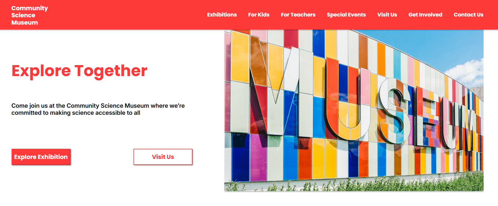

# Semester Project - Community Science Museum

A responsive and accessible website for a fictional science museum,
designed and built as part of Semester Project 1 at Noroff.

## Live website

https://lee-wong13.github.io/Semester-Project-Ada/

## Description

- 8 pages covering exhibitions, events, kids, teachers, visit
  information, get involved, and contact
- Designed independently from low-fidelity wireframe to
  high-fidelity Figma prototype
- Responsive hamburger navigation menu built with JavaScript
- Fully responsive layout across mobile, tablet, and desktop
- Accessibility principles followed throughout — semantic HTML,
  alt text, colour contrast, and logical heading hierarchy
- Project managed using an Agile-inspired Kanban board on GitHub
- Validated with W3C Markup Validation Service and tested with
  Google Lighthouse

## Built with

- HTML5 — semantic structure throughout
- CSS3 (Flexbox, Media Queries, CSS Variables)
- Vanilla JavaScript — responsive navigation menu
- Figma — high-fidelity prototype
- Canva — low-fidelity wireframe
- GitHub — version control and Kanban project management

## What I Learned

- Learned how to plan and structure a multi-page website using
  a sitemap and information architecture
- Gained hands-on experience moving from low-fidelity wireframes
  to a full high-fidelity Figma prototype before coding
- Developed a stronger understanding of responsive design using
  Flexbox and media queries across 8 pages
- Learned how to use CSS variables for consistent theming
  across an entire project
- Built a responsive hamburger navigation menu using JavaScript
  for the first time
- Understood the importance of accessibility — colour contrast,
  semantic HTML, alt text, and keyboard navigation
- Learned to validate and test code using W3C and Lighthouse,
  and how to interpret and act on the results
- Understood the value of planning — using a Kanban board kept
  the project structured and manageable throughout

## Future Improvements

- Improving performance scores by further optimising hero
  images and reducing file sizes
- Adding JavaScript interactivity to more pages — such as
  a working event booking form and interactive exhibits section
- Expanding the For Kids and For Teachers pages with richer,
  more tailored content
- Adding smooth scroll animations and page transitions for
  a more polished user experience
- Connecting the events section to a live calendar or CMS
  so content can be updated without touching the code
- Further improving accessibility to reach a Lighthouse
  accessibility score above 95

## Acknowledgments

Built as part of the Frontend Development programme at Noroff
School of Technology and Digital Media. Thanks to my lecturer
and peers for their guidance and feedback throughout the semester.
